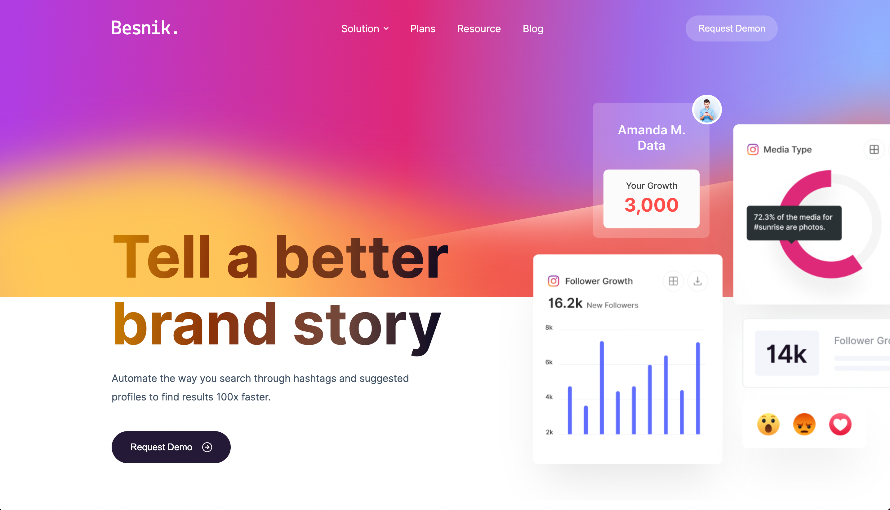

<h1>Besnik Sass Template | <a href="https://den-front.github.io/showcases/besnik-sass-template/">DEMO</a></h1>

Besnik Sass Template is a pet project for practice that includes all blocks for a startup site and a Sass product site. It is a full-responsive, fast, and smooth template built with Pug.js and Sass technology and using BEM methodology and clean code principles.

<h2>Technologies</h2>

Besnik Sass Template is built with:

- <a href="https://pugjs.org/">Pug.js</a> - Template engine
- <a href="https://sass-lang.com/">Sass</a> - CSS preprocessor
- <a href="https://parceljs.org/">Parcel Bundler</a> - Web application bundler
- <a href="http://getbem.com/">BEM methodology</a> - follows the bem methodology and clean code principles to ensure clean and reusable components
